# myHut

**Mobile RGB-D capture and 3D reconstruction with iPhone LiDAR, ARKit, SwiftUI, Python, and Open3D.**


myHut combines a SwiftUI/ARKit iOS app with a Python reconstruction backend. The app captures synchronized RGB images, depth and confidence maps, camera poses, intrinsics, timestamps, and frame metadata. The backend stores each session and reconstructs objects or indoor spaces.

> **Status:** Research and engineering prototype. A LiDAR-capable iPhone or iPad is recommended.

## Capabilities

- Synchronized ARKit RGB-D and camera-metadata capture
- Local streaming from iPhone to a Python backend
- Object, room-measurement, and full-room workflows
- Confidence-aware depth filtering and frame validation
- Pose-quality gating and coverage-aware keyframe selection
- Open3D TSDF fusion with object- and room-specific processing
- Mesh, point-cloud, measurement, confidence, and diagnostic outputs
- Optional ground-truth benchmarking and REST services

## System Overview

```mermaid
flowchart LR
    A["iPhone / iPad<br/>SwiftUI + ARKit"] -->|"RGB, depth, confidence,<br/>pose and intrinsics"| B["Upload server<br/>Port 5001"]
    B --> C["Session storage<br/>incoming → captures"]
    C --> D["Validation and preprocessing"]
    D --> E["Pose gate and<br/>keyframe selection"]
    E --> F["Open3D TSDF fusion"]
    F --> G["Object or room<br/>post-processing"]
    G --> H["Meshes, point clouds,<br/>metrics and guidance"]
```



## Capture Modes

| Mode | Use case | Product profile |
|---|---|---|
| `object` | Focused object reconstruction | `product_object_on_support` |
| `measure_room` | Room dimensions and structural surfaces | `product_room_measure` |
| `room_full` | Complete room geometry and layout | `product_room_full` |

## Repository Layout

```text
myHut/
├── iOS/myHut-iOS/                 # SwiftUI + ARKit capture app
└── backend/ark_fusion/
    ├── arkit_sensor_fusion/        # Reconstruction package
    ├── service/                    # Reconstruction API and workers
    ├── evaluation/                 # Accuracy and benchmark metrics
    ├── profiles/                   # Mode-specific YAML profiles
    ├── tests/                      # Automated tests
    ├── upload_server.py            # iPhone streaming server
    └── arkit_reconstruct.py        # Reconstruction CLI entry point
```

## Requirements

### iOS

- macOS with Xcode
- iPhone or iPad supporting ARKit scene depth
- LiDAR-capable device recommended
- iOS local-network permission

### Backend

- Python 3.10+
- macOS, Linux, or Windows
- Open3D-compatible environment
- iOS device and backend computer on the same local network

## Quick Start

### 1. Clone the repository

```bash
git clone https://github.com/goapu/myHut.git
cd myHut
```

### 2. Install and start the upload server

```bash
cd backend/ark_fusion
python3 -m venv .venv
source .venv/bin/activate
python -m pip install --upgrade pip
pip install -e .
python upload_server.py --host 0.0.0.0 --port 5001 --workspace .
```

On Windows PowerShell, activate the environment with:

```powershell
.venv\Scripts\Activate.ps1
```

### 3. Configure and open the iOS app

From the repository root:

```bash
cp iOS/myHut-iOS/RGBrecoder/LocalConfig.example.swift \
   iOS/myHut-iOS/RGBrecoder/LocalConfig.swift
open iOS/myHut-iOS/RGBrecoder.xcodeproj
```

Edit `LocalConfig.swift`:

```swift
enum LocalConfig {
    static let serverIP = "YOUR_COMPUTER_LOCAL_IP"
    static let serverPort = "5001"
}
```

In Xcode, select your development team and run the app on a physical device. Keep the device and backend computer on the same Wi-Fi network.

> `LocalConfig.swift` is intentionally ignored by Git. Commit only `LocalConfig.example.swift`.

## Reconstruct a Saved Capture

From `backend/ark_fusion`:

```bash
python arkit_reconstruct.py \
  --dataset ./captures/SESSION_NAME \
  --output ./outputs/SESSION_NAME \
  --mode object \
  --use-confidence
```

Replace `object` with `measure_room` or `room_full` as needed. A product profile can provide mode-specific defaults:

```bash
python arkit_reconstruct.py \
  --dataset ./captures/SESSION_NAME \
  --output ./outputs/SESSION_NAME \
  --profile product_room_full \
  --use-confidence
```

Run `python arkit_reconstruct.py --help` for all filtering, masking, pose-refinement, fusion, and benchmarking options.

## Data Layout

A saved capture contains synchronized frame data:

```text
captures/SESSION_NAME/
├── rgb/
├── depth/
├── confidence/
├── pose/
├── intrinsics/
├── timestamp/
├── frame_metadata/
└── metadata/
```

Typical reconstruction outputs include:

- Raw and cleaned meshes or point clouds
- Camera trajectory and selected/rejected frame records
- Room dimensions and detected planes
- Scan guidance and reconstruction-confidence reports
- Benchmark reports when ground truth is supplied

## Upload and Reconstruction API

The iOS app sends frame data to:

```text
POST /upload/rgb
POST /upload/depth
POST /upload/confidence
POST /upload/pose
POST /upload/intrinsics
POST /upload/timestamp
POST /upload/frame_metadata
POST /upload/metadata
POST /command
```

Trigger reconstruction for a saved session:

```bash
curl -X POST http://localhost:5001/reconstruct/SESSION_NAME \
  -H 'Content-Type: application/json' \
  -d '{"mode":"room_full","use_confidence":true}'
```

See [`backend/ark_fusion/MYHUT_BACKEND_README.md`](backend/ark_fusion/MYHUT_BACKEND_README.md) for backend integration details.

## Docker

Start the upload server and reconstruction API:

```bash
cd backend/ark_fusion
docker compose up --build
```

Services are exposed on:

- `5001` — iPhone upload server
- `8000` — reconstruction API

## Tests

```bash
cd backend/ark_fusion
pip install -e '.[dev]'
pytest -q
```

## Data and Privacy

RGB-D captures may contain people, private interiors, or location-specific details. Obtain consent before recording and keep raw captures secure.

The repository ignores local configuration, captured sessions, generated reconstructions, virtual environments, caches, and large 3D artifacts. Before committing, verify with:

```bash
git status
```

Do not commit:

- `LocalConfig.swift` or `.env` files
- `incoming/`, `captures/`, or `outputs/`
- Raw RGB-D data or generated meshes
- API keys, credentials, or identifiable private data

## Troubleshooting

- **Device cannot connect:** confirm the IP address, port `5001`, firewall rules, local-network permission, and shared Wi-Fi network.
- **Capture is not saved:** check the running upload server, `incoming/`, and whether the app sent the save command.
- **Empty or poor reconstruction:** verify RGB, depth, pose, and intrinsics files; choose the matching mode; scan slowly with overlapping views and stable lighting.
- **Dependency errors:** activate the virtual environment, upgrade `pip`, and reinstall with `pip install -e .`.

## License

This project is licensed under the [MIT License](LICENSE).
